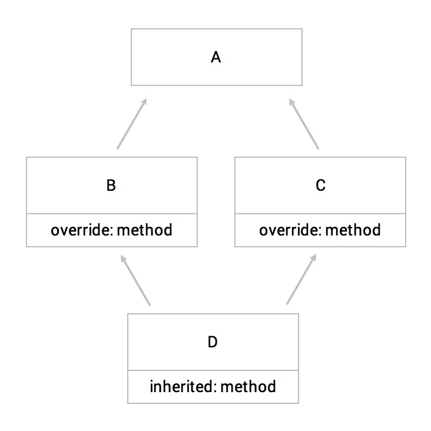

# 面向对象特点

####多态

多态是指同一个消息传递给不同的对象时会产生不同的动作，比如Animal类下有duck和dog两个对象，当他们收到相同的run消息后表现出跑的动作就是不同的。

对多态有了基本的印象后，我们从如下几个方面展开说明：函数多态、变量多态、子类型多态。

** 函数多态（Ad hoc polymorphism）**

函数多态接受不同类型参数，并根据不同的参数类型返回不同的值。函数重载和操作重载是最常见的函数多态。

```java
//Java 函数重载

class Demo{

  public  static int add(int a, int b){
    return a + b;
  }
  public  static String add(String a, String b){
    return a + b;
  }

  public static void main(String args[]){
    int result1 = Demo.add(1, 2);
    String result2 = Demo.add("String ", "combined!");

    System.out.println(result1);    //3
    System.out.println(result2);    //String combined!
  }
```

Java本身不提供运算符重载，而Ruby的操作符运算本身就是一个函数，所以Ruby中的运算符重载只需要重载函数即可。

```ruby
#Ruby 运算符重载

class Demo
 def initialize a
   @a = a
 end
  def +(b)
    "plus b equal to" + (@a+b).to_s
  end
end

a = Demo.new(2)
puts a + 2    #4
```

** 变量多态（parametric polymorphism）**

参数多态允许函数或数据类型采用同一定义，但是可以处理不同类型的变量。变量多态在保证静态类型安全的情况下使语言的表述更加清晰简明。

在Java语言中通过泛型来实现变量多态，当然动态类型语言在运行时会自动适配参数的数据类型，因此实现上加简洁。

```java
//Java 泛型

public class Tree<T>{
  private T value;
  private Tree<T> left;
  private Tree<T> right;
  
  public void replaceAll(T value){
    this.value = value;
    if(left != null)   left.replaceAll(value);
    if(right != null)  right.replaceAll(value);
  }
}
```

**子类型多态（Subtyping）**

一些语言提供了子类型多态的概念，子类型多态允许你在定义函数的时候使用父类型做形参，但实际使用的实参可以是其子类型。

```java
//Java 子类型多态

abstract class Pet {
  abstract String run();
}
class Dog extends Pet {
  String run() {
    return "run with four legs";
  }
}
class Duck extends Pet {
  String run() {
    return "run with two legs";
  }
}

public class Main{
  public static void petRun(Pet p){
    System.out.println(p.run());
  }
  public static void main(String args[]){
    Main.petRun(new Dog());     //run with four legs
    Main.petRun(new Duck());    //run with two legs
  }
}
```
上述代码中定义了petRun方法，形参为Pet类，实参为Pet类的子类Dog或Duck，因此实际上调用的run方法是子类的一个实现。

这里特别说明一点，子类型多态和继承是两个不同的概念，子类型多态强调的是类型之间的关系，即子类型可以替代父类型；而继承强调的是对象间的关系，即一类对象可以从另一类对象衍生出来。

最后我们通过变量多态和子类型多态组合使用的例子来加深对多态的认识。

```java
//Java 多态

interface Runner{  String run(); };

class Dog implements Runner{
  public String run(){
    return "run with four legs";
  }
}
class Duck implements Runner{
  public String run(){
    return "run with two legs";
  }
}

class Pet<T extends Runner>{
  private T pet;
  public Pet(T pet){
    this.pet = pet;
  }
  public String run(){
    return pet.run();
  }
}

public class Main{
  public static void main(String args[]){
    Pet<Dog> dog = new Pet<Dog>(new Dog());
    Pet<Duck> duck = new Pet<Duck>(new Duck());

    System.out.println(dog.run());     //run with four legs
    System.out.println(duck.run());    //run with two legs   
  }
}
```
我们整理下上述代码的逻辑：

1. 首先声明了一个Runner的接口，接口中定义了一个名为run的行为。
2. 然后创建了Dog类和Duck类，他们分别实现了Runner接口的run行为。
3. 接着定义了一个Pet类，这个类需要传递一个实现了Runner接口的泛型（类）。
4. 在Pet类定义了一个run方法，这个方法返回的是实现了Runner接口的类型T的run方法。
5. 执行主函数，声明了两个Pet类，一个传入的类型T是Dog，另一个是Duck，最后分别调用这两个Pet的run方法。


####封装

封装是通过类将数据和函数包装起来，封装具有如下作用：

1. 将数据、函数的实现细节隐藏，简化使用
2. 防止外界直接访问包装内的数据、函数

与封装密切相关的一个概念是访问级别，它定义了外部访问包装内数据和函数的规则。

**访问级别（Access Level）**

访问级别用来控制一个类的属性或方法能否被其他类访问，以Java的访问级别为例来说明包括：private、protected、public和no modifier（不定义）这四种，其对应的访问权限如下表(Y表示可访问，N表示不可)

| 修饰符/场景 | 当前类 | 当前包 | 子类 | 全局 |
| -- | -- | -- | -- | -- |
| public| Y | Y | Y | Y |
| protected | Y | Y | Y | N |
| no modifier | Y | Y | N | N |
| private | Y | N | N | N |

假设A是B的父类，如果A中的一个属性p是用private修饰的话，那么B是无法访问这个属性的。相对的如果属性p是用public修饰的，那么B就可以访问这个属性。

```java
//Java 访问权限

class A {
  protected String a = "protected prop can access subclass";
  private int b = "private prop can not access in subclass";
}

class B extends A {}

public class Main{
  public static void main(String args[]){
    B b = new B();
    System.out.println(b.b);    
    //error: b has private access in A
  }
}
```

JavaScript中没有提供私有属性的概念，通常的人为的用`_`为开头命名一个私有变量，使用时避免在外部访问某对象的以`_`为开头命名的变量就可以了。

继续刚才的例子，如果你就想用B来访问A的私有属性p，那么你可以在A中定义一个public/protected修饰的方法，然后通过这个方法返回p。
```java
//Java 通过公开的方法访问私有属性

class A {
  private int p = 1;
  protected int getP(){
    return this.p;
  }
}

class B extends A {}

public class Main{
  public static void main(String args[]){
    B b = new B();
    System.out.println(b.getP());    //1
  }
}
```
或者通过Java的反射机制获取。
```java
//Java 反射

import java.lang.reflect.*;
class A {
  private int p = 1;
}

public class Main{
  public static void main(String agrs[])throws Throwable {
    A a = new A();
    Field field = a.getClass().getDeclaredField("p");
  	field.setAccessible(true);
  	Object b = (int)field.get(a);
  	System.out.println(b);    //1
  }
}
```
Python和Ruby则提供了直接访问私有属性的语法糖。
```ruby
#Ruby 访问私有成员

class A
  def initialize
    @a = 10
  end
 
  private
  def private_method(b)
    return @a + b
  end
end

a = A.new
puts a.send(:private_method, 20)     #30
puts a.instance_variable_get(:@a)    #10
```

####继承

类或对象继承自另一个类或对象就能具备其属性和方法，通常继承分为三种：单继承、多重继承和多级继承。

B继承自A这种叫做单继承；C继承自A和B叫做多重继承；C继承自B，B继承自A叫做多级继承。

单继承和多级继承本身不存在什么问题，但多重继承却存在很多的问题，最典型的问题就是菱形继承问题（diamond problem）。



如图B、C都继承自A，并且重写了A的metho的方法，而D继承自B和C，同时D没有重写method方法，那么这时D的method方法究竟该继承自B，还是继承自C，这就是菱形继承问题。

因为多重继承暴露出太多的问题，所以多数语言规定不允许多重继承，但多重继承又是不可或缺的功能，比如铅笔即属于文具，又是木制品，那么它要满足这两点，就需要继承文具类和木制品类，那么该如何处理这种需求呢？

不同的语言提出了不同的方案：

**混合（Mixin）**

Mixin也是一种代码复用的策略，任何对象都可以通过Mixin拓展方法，与类的多重继承一样，一个对象可以引用多个Mixin。

Ruby就是采用Mixin的方式实现多重继承的代表。

```ruby
#Ruby 混合

module Action
  def jump
    "jump with legs"
  end
end

module Sound
  def say
    "say #{@sound}"
  end
end

class Cat
  def initialize
    @sound = "mew"
  end
  include Action
  include Sound
end

cat = Cat.new
puts cat.jump    #jump with legs
puts cat.say     #say mew
```

上面我们定义了两个Mixin，一个用于描述动作，一个用于描述叫声。我们只需要在类的定义时通过include关键字引入Action和Sound就可以调用相关的方法了。

注意Ruby的类中如果存在和module（Mixin）里定义的同名的方法，则以类中的方法体为准，如果多个module定义了同一方法，就以最后拓展（include）的那个为准。Ruby正是通过这种设计避免了多重继承中的菱形继承的问题。

**Trait**

Trait和Mixin类似也是用来拓展类的方法的，只是Trait中不允许实例化对象，同时如果引用的两个Trait存在同名函数，那么将不会采取任何策略解决这个问题，而会直接抛出异常。

我们来看下Scala中Trait的使用。
```scala
//Scala Trait

class Person
trait Nice{
  def greet() = println("Hello")
}

class Character extends Person with Nice

val american = new Character()
american.greet    //Hello
```
上面我们定义了一个父类Person以及一个Trait，然后定义了一个Character类，让他继承自Person，同时使用了Trait拓展。这样Character在没有定义任何方法时也是可以访问Nice的greet方法的。

**接口（Interface）**

接口和Mixin、Trait类似，也是用来给类拓展方法的，与Mixin、Trait不同的是，接口只定义方法，但不实现。接口的实现由其实现类实现。

```java
//Java 接口

interface Move{
  String jump();
}
interface Sound{
  String say();
}
class Cat implements Move, Sound{
  public String jump(){
    return "jump with legs";
  }
  public String say(){
    return "mew";
  }
}

public class Main{
  public static void main(String args[]){
    Cat cat = new Cat();
    System.out.println(cat.jump());    //jump with legs
    System.out.println(cat.say());     //mew
  }
}
```
因为接口规定了实现由类完成，所以多个接口中存在同名函数时也是不会有任何问题，因为类的函数实现肯定是唯一的。

注意Java中的接口和抽象类不同，抽象类的抽象方法和接口类似。在只需要拓展一个接口的情况下可以用抽象方法取代接口，但需要拓展多个接口的时候抽象类是无法取代的，所以接口主要处理的问题还是多重继承。

**组合（composition）**

组合也是一种实现多重继承的方式，简单的说就是一个类的属性是另外一个类，此时这个类中就可以通过这个属性来调用另一个类的方法了，出于理解方便你可以把这个类看做是一个Mixins。一般我们称继承为is a关系，称组合为has a关系，即：

1. A是B的一个子类，那么A自然是B，所以A is a B
2. A通过组合引用了B，那么A中有B，所以A has a B

```java
//Java 组合

class Move{
  public String jump(){
    return "jump";
  }
}
class Sound{
  public String say(String word){
    return word;
  }
}

class Cat{
  String word;
  Move move;
  Sound sound;
  Cat(){
    this.word = "mew";
    this.move = new Move();
    this.sound = new Sound();
  }

  public String jump(){
    return this.move.jump();
  }
  public String say(){
    return this.sound.say(this.word);
  }
}

public class Main{
  public static void main(String args[])
  {
    Cat cat = new Cat();
    System.out.println(cat.jump());    //jump
    System.out.println(cat.say());     //mew
  }
}
```
我们来看下上面这段代码:

1. 首先定义了一个Move类，实现了jump方法
2. 然后定义了一个Sound类，实现了say方法
3. 接着定义Cat类，组合Move类和Sound类作为属性
4. 重写Cat类的构造函数，实例化move对象和sound对象。
5. 在Cat类中定义jump方法和say方法，方法体内分别调用move的jump方法及sound的say方法


####抽象

抽象用来隐藏复杂的底层细节，将关注点放在呈现的结果，一般而言抽象分两种。

1. 操作抽象，比如编程语言中的`+`运算符，你只需要知道它能够处理加法运算就行，不需要知道底层的实现细节
2. 数据抽象，比如编程语言中的Number类型，你只需知道它用来存储数字类型就行，不需要知道底层的存储细节

面向对象中的抽象也是用于隐藏实现细节的。在Java语言下抽象通过抽象（abstract）和接口（interface）两种方式实现。

这里就不再重复说明接口了，抽象和接口功能类似，它可以用来修饰类也可以修饰方法。通过abstract修饰的类叫做抽象类，修饰的方法叫做抽象方法。抽象类不能实例化，一般作为父类使用，抽象方法不需要定义方法体，方法体由子类实现。另外因为抽象方法需要子类来实现，所以abstract不能和private（子类是没有访问父类的私有属性的权限的）一起使用。
```java
//Java 抽象

abstract class Animal{
  public abstract String say();
}

class Cat extends Animal{
  public String say(){
    return "mew";
  }
}

public class Main{
  public static void main(String agrs[]){
    Animal animal = new Animal();    
    //error: Animal is abstract; cannot be instantiated

    Cat cat = new Cat();
    System.out.println(cat.say());     //mew
  }
}
```
抽象作为一种多态的实现机制对于Ruby这种动态类型的语言而言是不需要的，因为在动态类型语言中函数参数和返回值无需强制声明，解释器会根据类型推导机制自动判断。
```java
//Java 函数重载
public String getA(String a){
  return a;
}

public int getA(int a){
  return a;
}
```
```ruby
#Ruby 函数定义
def getA(a)
  return a
end
```
从上面例子可以看出Java这种静态类型语言需要显式的声明函数的参数类型和返回值类型。因为参数类型或返回值类型不同的同名函数是两个不同的函数，所以Java中抽象的概念是必要的。而在Ruby这种动态类型语言中，参数类型和返回值类型是程序在运行时动态决定的，函数本身就能够接收不同类型的输入参数，所以抽象类和抽象方法是没有必要的，这也是Ruby不支持抽象类和抽象方法的原因。

虽然Ruby本身没有提供对抽象的支持，但是还是可以通过抛出异常的方式来模拟抽象方法或者抽象类的。

```ruby
#Ruby 模拟抽象方法

class Animal
  def say
    raise "abstract method"
  end
end

class Cat < Animal
  def say
    return "mew"
  end
end

c = Cat.new
puts c.say    #mew
```
我们在Animal里定义了一个say方法，该方法没有执行任何操作，只是抛出一个异常（防止直接调用这个方法），然后我们声明了个Cat类继承了Animal，并重写了say方法。这样通过抛出异常的方式限制父类的say方法直接调用，来模拟Java的抽象方法。

