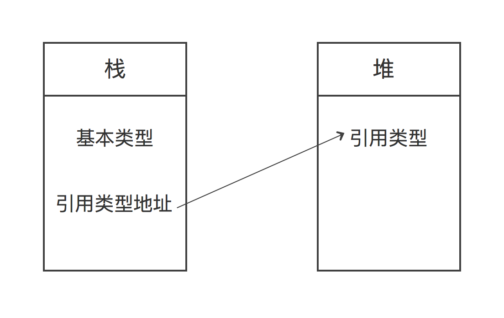

# 基础类型和引用类型

一般数据类型都会分为两种：基础类型和引用类型。不同语言中可能术语不同（C#中叫做值类型），但实际上是同一个概念。

**基础类型**
1. 基础类型存储的是直接值。
2. 基础类型的值存储在栈中。
3. 基础类型是不可修改的（不可变的）。
4. 基础类型进行比较时，直接值相等就相等。
5. 基础类型在作为参数传递时，传递的是值。

**引用类型**
1. 引用类型存储的是地址。
2. 引用类型的值存储在堆中。
3. 引用类型是可修改的（可变的）。
4. 引用类型进行比较时，值相等，且地址相等才相等。
5. 引用类型作为参数传递时，传递的是引用。

接下来对上面的五点分别举例说明。

**值的存储**

基础类型在栈中存储直接值，而引用类型在栈中存储引用的地址，真正的值存储在堆中。对于编译型语言而言栈是在编译时处理内存的分配的，在运行时处理堆的内存分配，所以栈的内存分配是静态的，堆的内存分配是动态的，栈中存储的数据是固定大小的，而堆中的数据是可变大小的。同时编译型语言在编译型处理了基础类型的内存分配，相比解释型语言在运行时的处理速度效率自然要高。
对于基础类型和引用类型的存储情况可以参考下图。

**是否可变**

基础类型是不可变的，这里的不可变不是指变量值的不可变，而是存储在栈下制定地址的值是不允许改变的。因为获取一个值的地址对于现在的编程语言来说并没有实际作用，所以语言本身没有提供API，有些解释器也不对此进行处理，这里只用Ruby代码来说明以上`地址存储的值不可变`的意思（幸亏Ruby是支持的）。
```ruby
a = 5
a.object_id    #=>11
a = 5
a.object_id    #=>7
b = 5
b.object_id    #=>11
```
这里我们先对变量a赋值为5，然后输出5对应在栈中的地址11（转换为二进制是0b1011），然后我们修改a的值，再次输出a的地址，会发现地址改变了，这说明a的值改变了，是因为a的地址变了。然后我们队b赋值为5并输出地址，会发现其地址也是11，这说明地址为11的内存中存储的值就是5，是不会改变的，变量值的改变是因为指向的地址发生了改变。

引用类型是可变的，根据上述描述，可以猜测到所谓可变是指存储引用类型的地址所存储的值是可以改变的。
数组是引用类型的，我们修改数组中元素的值，然后输出数组的地址信息进行对比。
```ruby
a = [1, 2, 3]
a.object_id    #=>70324083600480
a[0] = 0
a.object_id    #=>70324083600480
```
可以发现数组的值改变了，但是其地址信息没有改变，说明引用类型的值是可变的。如果你输出`a[0].object_id`会发现这个地址是变化了的，因为a[0]是个数字类型，数字类型是基本类型，他的值是不可变的，所以a[0]指向了改变后的值的地址。但是数组a的地址不会因为元素值的修改而修改，除非你对a重新赋值（Java是不允许这样做的，Java只允许数组初始化时整体赋值或者循环每一个元素分别赋值）。
```ruby
a = [1, 2, 3]
a.object_id    #=>70324083600480
a = [0, 1, 2]
a.object_id    #=>70324083654580
```
**比较**

比较是很简单的，值类型只要值相等就是相等的。而引用类型确保引用的对象是同一个，也就是说栈中存储的地址是指向堆中同一个位置的，这就要求值和地址都要一致。
```javascript
//javascript
a = 1;
b = 1;
a === b;    //=>true
a = [1, 2, 3];
b = [1, 2, 3];
a === b;    //=>false
```
```java
//java
int a = 1;
int b = 1;
System.out.print(a == b);    //=>true

int a[] = { 1, 2, 3 };
int b[] = { 1, 2, 3 };
System.out.print(a == b);    //=>false
```
```ruby
#ruby
# 注意Ruby中`==`用于判断两个对象值是否相等，
# equal？才用于判断是否为同一个对象。
a = 1
b = 1
a.equal? b    #=>true
a = [1, 2, 3]
b = [1, 2, 3]
a.equal? b    #=>false
```

**参数传递**

基础类型传递的是值，而引用类型传递的是引用。值类型发生修改是无副作用的（不会修改原变量），引用类型修改是副作用的。
```javascript
//javascript
var a = 1;
var o = { b: 1 };
var fa = function(a){  a = 2;  }
var fo = function(o){  o.b = 2;  }
f(a);
f(o);
console.log(a);      //=>1
console.log(o.b);    //=>2
```
对于变量拷贝也是如此，基础类型拷贝的是值修改是无副作用的，引用类型拷贝的是引用，修改是有副作用的。
```javascript
//javascript
var a = 1
,   b = a
,   oa = { a: 1 }
,   ob = oa;
b    = 2;
ob.a = 2;
console.log(a);       //=>1
console.log(oa.a);    //=>2
```